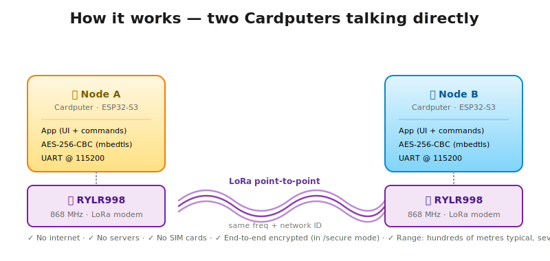
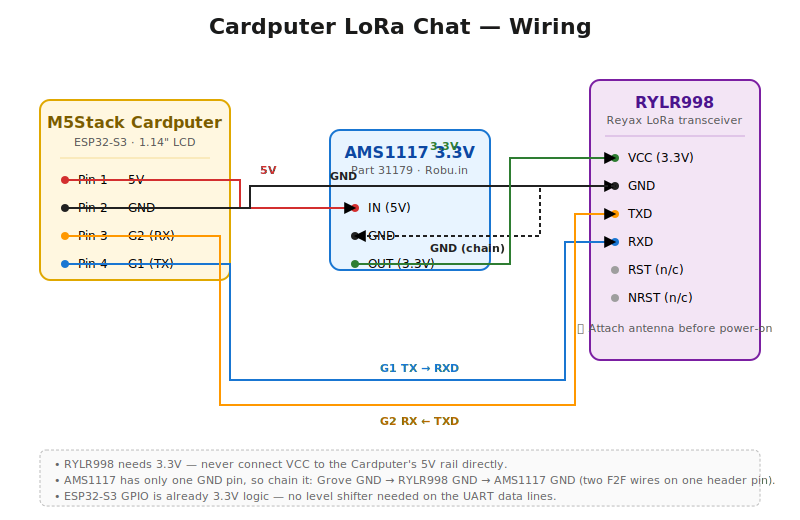
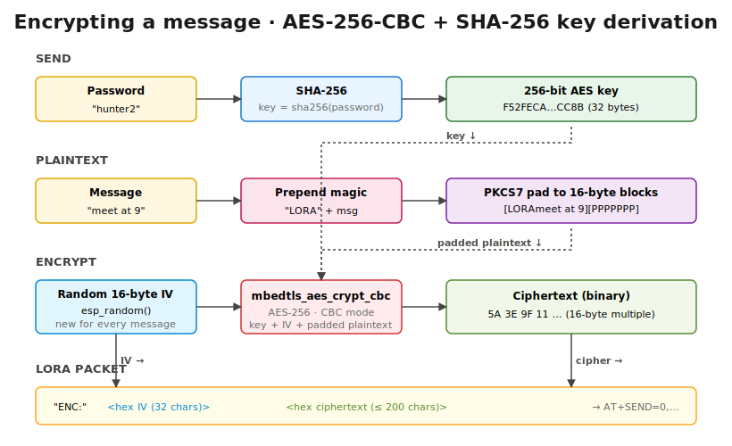

<div align="center">

# Cardputer LoRa Chat

**A pocket-sized, password-protected, AES-256 encrypted LoRa chat client for the M5Stack Cardputer.**

[](LICENSE)
[](https://www.espressif.com/en/products/socs/esp32-s3)
[](https://www.arduino.cc/)
[](#)



Two Cardputers. Two Reyax RYLR998 LoRa modules. No internet, no servers, no SIM cards.
Just long-range, encrypted, point-to-point messaging in your pocket.

[Hardware](#hardware) · [Wiring](#wiring) · [Build & Flash](#build--flash) · [Usage](#usage) · [How it works](#how-it-works)

</div>

---

## Features

- **Two-way text chat** over LoRa between any number of nodes on the same frequency/network.
- **Password-locked screen** — device unlocks only after entering a passphrase. `/lock` re-locks anytime.
- **`/secure` mode** with real **AES-256-CBC** encryption (mbedtls), per-message passwords, random IV.
- **Live radio control** — change frequency, network ID, address and TX power from the chat input with `/freq`, `/net`, `/addr`, `/pwr`.
- **Raw AT debug** with `/at <ATCMD>` so you can talk directly to the RYLR998.
- **Audible alert** on incoming messages.
- **Loadable from SD** with M5Launcher / Bruce / any community Cardputer launcher, or flashed directly with M5Burner / arduino-cli.

## Hardware

| Component | Qty (per node) | Approx. USD | Approx. INR | Notes |
|---|---:|---:|---:|---|
| **M5Stack Cardputer v1.1** | 1 | $30 | ₹2,500 | ESP32-S3, 1.14" LCD, 56-key keyboard |
| **Reyax RYLR998 LoRa module** | 1 | $14 | ₹1,200 | 868/915 MHz, AT-command UART, antenna included |
| **AMS1117 3.3V regulator board** *(Robu.in Part 31179)* | 1 | $1 | ₹50 | 3-pin breakout: IN, GND, OUT |
| **F2F jumper wires** | 6 | $3 (pack) | ₹150 (pack) | Standard 2.54mm Dupont |
| **USB-C cable** | 1 | — | — | For flashing; you probably have one |
| **microSD card** *(optional)* | 1 | $5 | ₹400 | Only if loading via SD launcher |

**Total cost per node: ≈ $48 USD / ₹3,900 INR**
**Two-node chat setup: ≈ $96 USD / ₹7,800 INR**

> **Want a cleaner build?** See [`hardware/pcb/`](hardware/pcb/) for an open-source PCB design that replaces the AMS1117 breakout + jumper wires with a single board that plugs directly into the Grove port. Adds ~$1.20 / ₹90 per node but is far more reliable.

> **Frequency note** — the RYLR998 covers 868 MHz (EU/IN) and 915 MHz (US) by configuration. Make sure your chosen band is legal in your country. Default in this firmware is **865 MHz** (India ISM band). Change with `/freq` or by editing `loraFreq` in the source.

## Wiring

<div align="center">

</div>

| Cardputer Grove pin | Connects to | Notes |
|---|---|---|
| Pin 1 — 5V | AMS1117 **IN** | power input to regulator |
| Pin 2 — GND | RYLR998 **GND** + AMS1117 **GND** | shared ground (see below) |
| Pin 3 — G2 (GPIO 2) | RYLR998 **TXD** | UART RX on Cardputer |
| Pin 4 — G1 (GPIO 1) | RYLR998 **RXD** | UART TX on Cardputer |
| AMS1117 **OUT** | RYLR998 **VCC** | 3.3V regulated |

**The "two GND wires on one pin" trick**: the AMS1117 module has only one GND pin, so chain it: Grove GND → RYLR998 GND, then a second wire from RYLR998 GND → AMS1117 GND. Two female ends side-by-side on the RYLR998 GND header pin works fine for prototyping. See [`docs/HARDWARE.md`](docs/HARDWARE.md) for alternatives.

## Build & Flash

### Prerequisites

Install **arduino-cli**:

```bash
# Linux / macOS
curl -fsSL https://raw.githubusercontent.com/arduino/arduino-cli/master/install.sh | sh
sudo mv bin/arduino-cli /usr/local/bin/

# macOS via Homebrew
brew install arduino-cli

# Windows: download zip from https://arduino.github.io/arduino-cli/latest/installation/
```

### One-command build & flash

```bash
git clone https://github.com/<you>/cardputer-lora-chat.git
cd cardputer-lora-chat/firmware

# Edit the unlock password before flashing (default: "letmein")
$EDITOR cardputer_lora_chat.ino   # look for: const char* PASSWORD = "letmein";

# Find your Cardputer's USB port
arduino-cli board list
# expect something like /dev/cu.usbmodem2101 (macOS) or /dev/ttyACM0 (Linux) or COM3 (Windows)

# Compile + upload in one step
arduino-cli compile --fqbn esp32:esp32:m5stack_cardputer \
    --upload --port <YOUR_PORT> \
    cardputer_lora_chat.ino
```

The included `build.sh` (Linux/macOS) and `build.bat` (Windows) wrap library installation and compilation. See [`docs/BUILDING.md`](docs/BUILDING.md) for the full guide including PlatformIO, Arduino IDE, and SD-card launcher workflows.

## Usage

<div align="center">

</div>

1. Power on. Type your password at the lock screen, press **Enter**. Two beeps = unlocked.
2. Type any message and **Enter** to broadcast it. Anything received from a peer on the same network shows up in cyan.
3. Type `/help` for the command list.

### Commands

| Command | Action |
|---|---|
| `/help` | List commands |
| `/freq <Hz>` | Change frequency (e.g. `/freq 868500000`) |
| `/net <n>` | Set network ID (must match peers) |
| `/addr <n>` | Set my address (0–65535) |
| `/pwr <n>` | TX power (0–22 dBm) |
| `/info` | Show current radio settings |
| `/clear` | Clear chat history |
| `/lock` | Re-lock the device |
| `/at <ATCMD>` | Send raw AT command to RYLR998 (debug) |
| `/secure` | Toggle encrypted send mode |
| `/d <N>` | Decrypt encrypted message #N |

### Secure mode

<div align="center">

</div>

When `/secure` is on, the status bar shows `[SEC]`. Every message you send goes through a password prompt before transmission:

1. Type a message → **Enter** → "Encrypt" prompt appears.
2. Type a password → **Enter**. Message is AES-256-CBC encrypted and broadcast.
3. Recipient sees `< [ENC #3]` (magenta, locked). They type `/d 3`, enter the same password, and the plaintext appears.

The encryption uses **mbedtls** (the same library inside the ESP32 ROM as on Signal/OpenSSL servers): SHA-256 of the password as the 256-bit key, random 16-byte IV per message, PKCS7 padding. A magic `LORA` prefix in the plaintext serves as a key-validation tag — wrong password → "decryption failed".

There's no built-in key exchange; both ends must agree on the password out-of-band. See [`docs/PROTOCOL.md`](docs/PROTOCOL.md) for the wire format.

## How it works

<div align="center">

</div>

- The Cardputer's ESP32-S3 talks to the RYLR998 over a software UART on **GPIO 1 (TX)** and **GPIO 2 (GND)** at **115200 baud**.
- The RYLR998 is configured at boot via AT commands (`AT+BAND`, `AT+NETWORKID`, `AT+ADDRESS`, `AT+CRFOP`).
- Outgoing messages are sent as `AT+SEND=0,<len>,<data>` — destination 0 = broadcast to everyone on the network.
- Incoming messages arrive as `+RCV=<addr>,<len>,<data>,<rssi>,<snr>` lines, which the firmware parses and displays.
- Encrypted messages travel as a plain string `ENC:<hex_iv><hex_ciphertext>` — they're still subject to LoRa's 240-byte payload limit, so the plaintext is capped at 90 chars.

Full design notes are in [`docs/PROTOCOL.md`](docs/PROTOCOL.md).

## Repository structure

```
cardputer-lora-chat/
├── README.md                        # this file
├── LICENSE                          # MIT
├── CONTRIBUTING.md                  # how to contribute
├── SECURITY.md                      # security policy & disclosure
├── CHANGELOG.md                     # version history
├── firmware/
│   ├── cardputer_lora_chat.ino      # main sketch
│   ├── platformio.ini               # PlatformIO config
│   ├── build.sh                     # arduino-cli build script (Linux/Mac)
│   └── build.bat                    # arduino-cli build script (Windows)
├── hardware/
│   └── pcb/
│       ├── README.md                # BOM + manufacturing guide
│       ├── gerbers.zip              # ← upload this to Robu / JLCPCB / PCBWay
│       ├── gerbers/                 # individual Gerber + drill files
│       ├── generate_gerbers.py      # design source, regenerable
│       ├── schematic.svg            # circuit diagram
│       └── board-preview.svg        # rendered top view, 50×22 mm
├── docs/
│   ├── HARDWARE.md                  # detailed BOM, sources, wiring tips
│   ├── BUILDING.md                  # all build/flash paths
│   ├── USAGE.md                     # extended usage docs
│   ├── PROTOCOL.md                  # LoRa packet format + crypto details
│   ├── wiring-diagram.svg
│   ├── architecture.svg
│   ├── state-machine.svg
│   └── encryption-flow.svg
└── .github/
    ├── ISSUE_TEMPLATE/
    └── workflows/build.yml          # CI: arduino-cli compile check
```

## Roadmap

- [ ] **Key exchange** — ECDH over LoRa so peers can negotiate a session key without out-of-band sharing
- [ ] **Persistent settings** — save freq/net/addr to NVS so they survive reboots
- [ ] **Group conversations** — show received message addresses as named contacts
- [ ] **Acknowledgements** — opt-in `+ACK` packets so the sender knows the message was received
- [ ] **Message history on SD** — encrypted log of all sent/received messages
- [ ] **Meshtastic interop** — optional Meshtastic-compatible packet mode

PRs welcome. See [`CONTRIBUTING.md`](CONTRIBUTING.md).

## License

MIT — see [`LICENSE`](LICENSE). You can use, fork, and ship this commercially; just keep the copyright notice.

## Acknowledgments

- **[M5Stack](https://m5stack.com/)** for the Cardputer and the excellent `M5Cardputer` / `M5Unified` / `M5GFX` libraries.
- **[Reyax](https://reyax.com/)** for the RYLR998 module and its straightforward AT command set.
- **[Espressif](https://www.espressif.com/)** for the ESP32-S3 and the included mbedtls implementation.
- **[Robu.in](https://robu.in/)** for stocking everything you need in India at sane prices.

---

<div align="center">

If this was useful, ⭐ the repo. If you build something on top of it, [open an issue](../../issues) — I'd love to see it.

</div>
