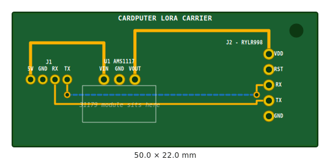
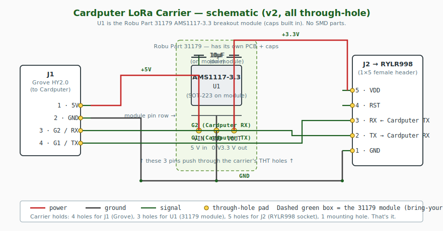

# Cardputer LoRa Carrier Board

A small, single-purpose PCB that plugs into the Cardputer's Grove port and provides regulated 3.3V plus a socket for the RYLR998 LoRa module. Replaces the F2F-wire + AMS1117 breakout setup with one clean board.

<div align="center">

</div>

## What's in this folder

| File | Purpose |
|---|---|
| `gerbers.zip` | **Upload this to your fab** (Robu, JLCPCB, PCBWay, etc.) |
| `board-preview.svg` | Visual preview of the manufactured board |
| `schematic.svg` | Circuit schematic |
| `gerbers/` | Individual Gerber + drill files (loose, in case the fab wants them separately) |
| `generate_gerbers.py` | Source for the design — re-run this if you tweak parameters |
| `README.md` | This file |

## Pin order on RYLR998 socket (J2)

Bottom to top, as shown on the silkscreen:

| Pin # | Net | Connects to |
|---:|---|---|
| 1 | **GND** | board ground |
| 2 | **TX** (RYLR's TX out) | Cardputer G2 (RX) |
| 3 | **RX** (RYLR's RX in) | Cardputer G1 (TX) |
| 4 | **RST** | unconnected (no reset needed) |
| 5 | **VDD** | 3.3V from AMS1117 output |

## Schematic

<div align="center">

</div>

## Bill of materials

| Ref | Component | Package | Qty | Notes | ~Cost (₹) | ~Cost ($) |
|---|---|---|---:|---|---:|---:|
| **PCB** | 2-layer, 50×22 mm, 1.6mm FR-4, HASL, green | — | 1 | upload `gerbers.zip` | ₹30–50 (qty 10) | $0.40–0.60 |
| U1 | AMS1117-3.3 LDO | SOT-223 | 1 | LCSC C6186 | ₹15 | $0.20 |
| C1 | 10 µF ≥6.3V ceramic | 0805 SMD | 1 | LCSC C15850 | ₹2 | $0.03 |
| C2 | 22 µF ≥6.3V ceramic | 0805 SMD | 1 | LCSC C45783 | ₹3 | $0.04 |
| J1 | Grove HY2.0 vertical, 4-pin | THT | 1 | Robu / Seeed | ₹25 | $0.30 |
| J2 | 1×5 female pin header, 2.54mm | THT | 1 | Robu / any shop | ₹10 | $0.15 |
| M1 | M2 × 6mm screw + nut (optional) | — | 1 set | hardware store | ₹5 | $0.05 |

**Cost per assembled node: ≈ ₹90 / $1.20** (in a qty-10 batch).

## How to order from Robu

1. Go to **https://robu.in/product/robu-pcb-manufacturing-service/** (the SKU 1373369 page).
2. Click **Upload Model**, select `gerbers.zip` from this folder.
3. Configure:
   - Base Material: **FR-4**
   - Layers: **2**
   - PCB Qty: **10** (minimum, costs the same as 5)
   - Different Design: **01**
   - Delivery Format: **Single PCB**
   - PCB Thickness: **1.6 mm**
   - PCB Color: **Green**
   - Surface finish: **HASL (with lead)** — cheapest, fine for hobby use
4. Wait for the quote (usually under an hour), pay, then receive boards in 2–3 weeks.

Same workflow works on JLCPCB, PCBWay, AllPCB — they all accept Gerber X2 + Excellon zips.

## ⚠️ VERIFY BEFORE MANUFACTURING

I generated these Gerbers programmatically without running them through KiCad or visualising them in a Gerber viewer. **You must verify before sending to fab.** Ten boards of bad Gerbers ≈ ₹500 and 3 weeks wasted.

**Required check:**

1. Open **https://gerber-viewer.ucamco.com/** (free, no signup).
2. Click **Drop files or click here**, drop in `gerbers.zip`.
3. Wait for all layers to load.
4. Inspect:
   - **Edge cuts** — should be a 50 × 22 mm rectangle
   - **Top copper** — 5 traces visible, all connecting expected pads
   - **Bottom copper** — solid GND pour, with clearance circles around non-GND through-holes
   - **Drill** — 5 holes at the J2 column, 4 holes at the J1 row, 3 small via holes, plus the M2 mounting hole
   - **Silkscreen** — readable text labels next to each pin
5. Compare layer-by-layer to [`board-preview.svg`](board-preview.svg) in this folder.

**Critical things to confirm:**

- [ ] J2 pin order matches your specific RYLR998 module: **GND, TX, RX, RST, VDD** (bottom to top)
- [ ] J1 pin order matches your Cardputer Grove pinout: **5V, GND, G2, G1** (left to right)
- [ ] No traces shorting to each other or to GND pour
- [ ] All through-holes have annular ring (pad larger than hole)
- [ ] Silkscreen text is readable, not on top of pads

If anything's off, edit `generate_gerbers.py` and re-run `python3 generate_gerbers.py` — the script regenerates everything.

## Board specs

| Property | Value |
|---|---|
| Outline | 50.0 × 22.0 mm |
| Layers | 2 |
| Thickness | 1.6 mm |
| Surface finish | HASL (with lead) or HASL-RoHS |
| Soldermask | Green |
| Min trace width | 0.3 mm (12 mil) |
| Min clearance | 0.4 mm (16 mil) |
| Min drill | 0.6 mm (via) |
| Mounting | 1 × M2 hole |

## Assembly order

1. **U1 (AMS1117 SOT-223)** — solder one corner first to anchor, then the other three terminals.
2. **C1 and C2 (0805 caps)** — tweezers, fine-tip iron. Don't mix them up (silk labels show which is which).
3. **J1 (Grove socket)** — pins through holes, solder from bottom.
4. **J2 (1×5 female header)** — same.
5. (Optional) **M2 screw** through M1 to mount the board to an enclosure.

Push the RYLR998 module into J2 with its pins lined up. Plug a 4-pin Grove cable between J1 and the Cardputer's Grove port. Power up.

## How the routing works

Looking at the [board preview](board-preview.svg), the amber lines are top-copper traces:

- **5V (thick)**: Grove pin 1 → C1 left pad → loops over the top → U1 VIN lead
- **3.3V (thick)**: U1 VOUT lead + tab → C2 left pad → loops over the top → J2 VDD pin
- **G1 TX (thin)**: Grove pin 4 → drops down → runs along the bottom → up to J2 RX pin (middle)
- **G2 RX (thin)**: Grove pin 3 → rises up → runs along the top → down to J2 TX pin
- **GND**: handled by the bottom-layer copper pour. Through-hole GND pins (Grove pin 2, J2 pin 1) connect directly to the pour. SMD GND pads (C1, C2, U1 lead 1) connect through small vias to the bottom pour.

Trace widths: 0.5 mm for power, 0.3 mm for signal. All clearances are 0.4 mm. Generous enough that any cheap fab can handle it.

## Modifying the design

Open `generate_gerbers.py` and edit:

- Board dimensions: `BOARD_W`, `BOARD_H` at the top
- Component positions: `J1`, `U1_LEADS`, `C1_PADS`, `C2_PADS`, `J2`
- Traces: the `TRACES` list — each entry is `{"width": ..., "points": [(x, y), ...]}`
- Silkscreen labels: `SILK_LABELS` list

Re-run with:

```bash
cd hardware/pcb
python3 generate_gerbers.py
```

Outputs land in `gerbers/` and re-zip into `gerbers.zip`. Re-verify in the Gerber viewer.
